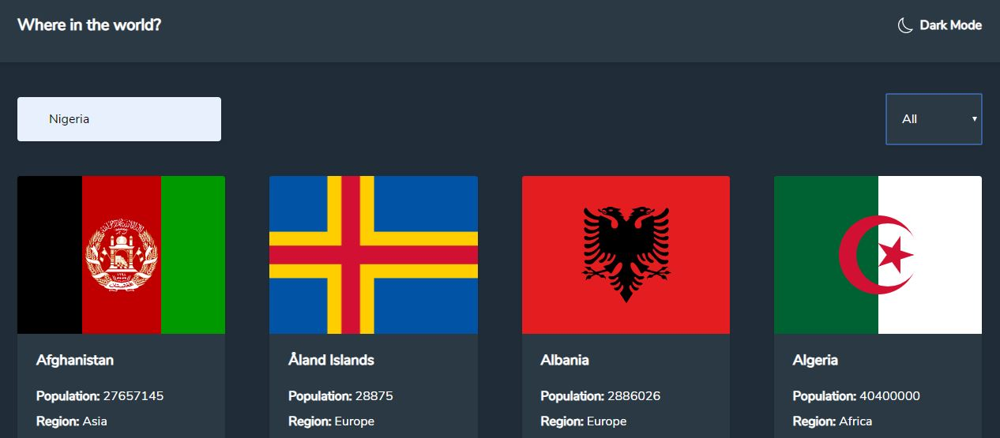

## Stack and Technologies

This website was built using React and Tailwindcss.
Routing was accomplished using Reach Router.

Features include:

1. Ability to search for any country in the world
2. Ability to display countries by continent
3. Light mode and dark mode

