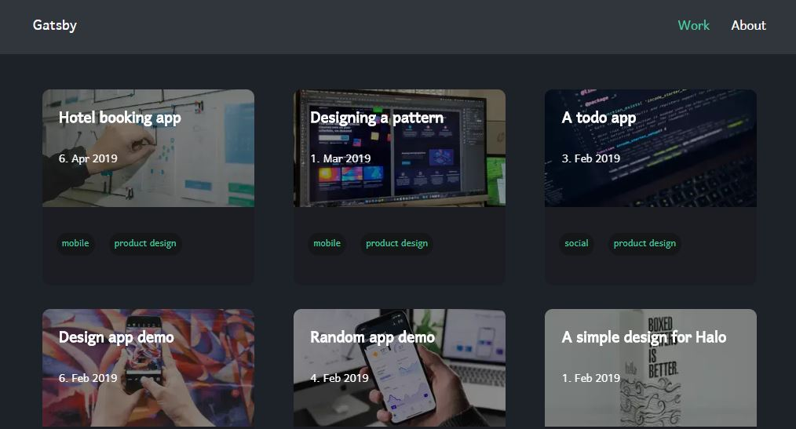

## What is Gatsby-portfolio-story
Gatsby-portfolio-story is a Gatsby starter for building portfolio sites. Its features include:

1. Tag support
2. Component styling with emotion
3. Dark mode by default	
4. Markdown for content
5. Image Optimisation with Sharp
6. PWA Support

I plan to make gatsby-portfolio-story more customisable and feature-rich in the future.

 

# Stack and Technologies
Gatsby-portfolio-story was built with Gatsby and emotion.

