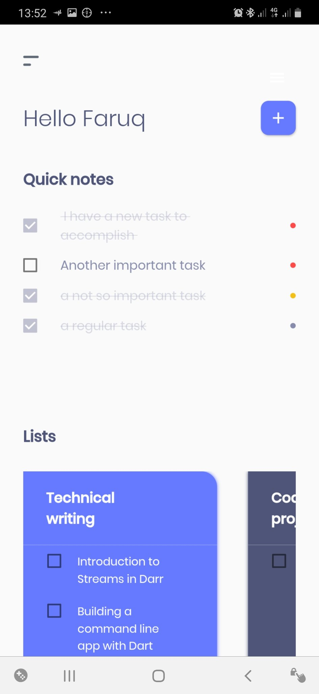
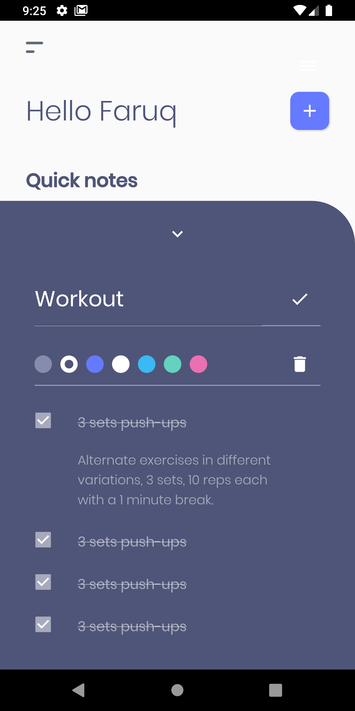
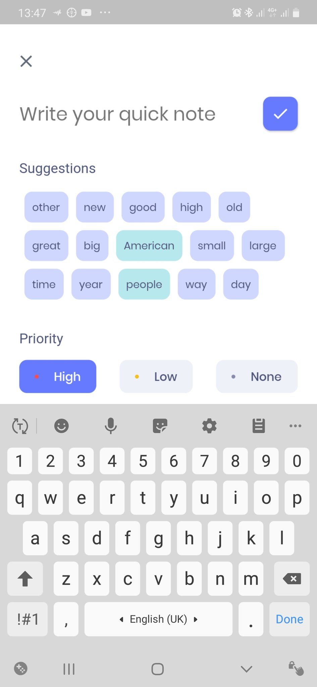
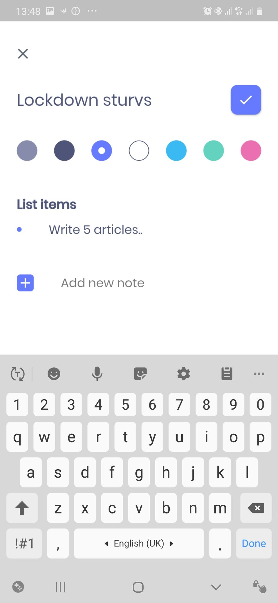

## What is My To-do Manager?
My To-do manager is an android app that allows users to manage todos with ease. General to-dos can be added as quick notes and more similar to-dos can be grouped together as Lists.

Features:

1. Users can sign in with their Google account.
2. Users can add general to-dos as quick notes and rank them in order of their priority.
3. Users can group similar to-dos in lists.

  
  
  
  

